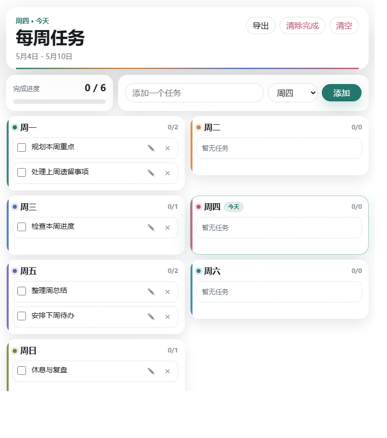

# 每周任务代办透明桌面小组件

一个用 **HTML + Electron** 做出来的 Windows 透明桌面待办小组件。

它来自一次 vibecoding：从“我想把每周任务直接放到桌面上”开始，一步步做成了可以添加、勾选、编辑、拖拽排序的透明桌面挂件。



## 功能

- 透明无边框桌面窗口，更像桌面组件，而不是普通网页。
- 周一到周日一屏展示，适合做每周计划。
- 添加任务、勾选完成、删除任务。
- 点击铅笔或双击任务文字即可行内编辑。
- 修改内容会自动保存。
- 同一天内拖动任务，可以交换顺序。
- 一键导出本周任务文本。
- 支持清除已完成、清空本周。
- 支持置顶、最小化、关闭窗口。
- 数据保存在本机，不需要账号。

## 适合谁

- 想把每周计划直接放在桌面上的人
- 想要一个轻量待办挂件的人
- 想展示 vibecoding 小作品的人
- 想学习 HTML + Electron 桌面小工具的人

## 环境要求

- Windows 10 / Windows 11
- Node.js 18 或更高版本
- npm
- Git

检查本机是否已安装：

```powershell
node --version
npm --version
git --version
```

## 安装

克隆仓库：

```powershell
git clone https://github.com/ShuoFeng-n/weekly-todo-widget.git
cd weekly-todo-widget
```

安装依赖：

```powershell
cd weekly-widget
npm install
```

## 运行

在 `weekly-widget` 目录运行：

```powershell
npm start
```

也可以在项目根目录运行：

```powershell
.\start-widget.ps1
```

如果依赖还没有安装，`start-widget.ps1` 会先自动执行 `npm install`。

## 创建桌面快捷方式

在项目根目录运行：

```powershell
.\install-desktop-shortcut.ps1
```

运行后，桌面会出现：

```text
每周任务代办-透明小组件.lnk
```

以后双击这个快捷方式就能打开小组件。

## 使用方法

### 添加任务

在顶部输入框输入任务，选择星期，然后点击“添加”。

### 完成任务

点击任务左侧的复选框。

### 修改任务

有两种方式：

- 点击任务右侧的铅笔按钮。
- 双击任务文字。

任务会变成输入框。你修改时会自动保存，按 `Enter` 或点击别处会退出编辑状态。

### 调整顺序

同一天内，按住一个任务拖到另一个任务上松开，就会交换两个任务的位置。

### 导出任务

点击顶部“导出”，当前每周任务会复制到剪贴板，格式类似：

```text
周一
[ ] 规划本周重点
[x] 处理上周遗留事项
```

### 清理任务

- “清除完成”：只删除已经勾选完成的任务。
- “清空”：清空本周全部任务，会先弹出确认。

## 数据保存在哪里

任务保存在本机的 `localStorage` 中。

这意味着：

- 不需要注册账号。
- 不会自动上传到云端。
- 换浏览器或换电脑不会自动同步。
- 如果清理 Electron 或浏览器应用数据，任务可能会被清除。

## 项目结构

```text
.
├─ weekly-todo.html              # 小组件页面和交互逻辑
├─ weekly-widget/
│  ├─ main.js                    # Electron 透明窗口
│  ├─ preload.js                 # 页面和 Electron 的安全桥接
│  ├─ package.json               # Electron 依赖和启动脚本
│  └─ package-lock.json
├─ start-widget.ps1              # 从项目根目录启动小组件
├─ install-desktop-shortcut.ps1   # 创建桌面快捷方式
├─ assets/
│  └─ preview.png                # README 预览图
├─ README.md
└─ LICENSE
```

## 开发

修改 `weekly-todo.html` 后，重新运行：

```powershell
npm start --prefix weekly-widget
```

如果窗口已经打开，关闭后再启动即可看到新效果。

Electron 默认优先加载桌面上的 `每周任务代办.html`；如果找不到，就加载项目里的 `weekly-todo.html`。

## 常见问题

### 为什么不用普通浏览器打开？

普通浏览器窗口很难做到真正透明桌面组件效果。这个项目用 Electron 创建透明、无边框窗口，再加载 HTML 页面，所以看起来更像桌面挂件。

### 为什么没有账号同步？

这个项目刻意保持轻量。它更像桌面便利贴，而不是完整任务管理软件。

### 可以打包成 exe 吗？

可以。后续可以加入 `electron-builder` 或 `electron-forge`，把它打包成可安装的 Windows 应用。

## 后续可以做什么

- 打包成 `.exe`
- 增加开机自启
- 增加窗口位置记忆
- 增加主题颜色
- 支持按周归档
- 支持备份/导入 JSON

## License

MIT

---

# Weekly Todo Transparent Desktop Widget

A transparent Windows desktop todo widget built with **HTML + Electron**.

This project started as a vibecoding experiment: “What if my weekly tasks could live directly on my desktop?” It gradually became a lightweight widget where you can add, check, edit, delete, and reorder weekly tasks.


## Features

- Transparent frameless desktop window.
- Weekly layout from Monday to Sunday.
- Add, check, edit, and delete tasks.
- Inline editing by clicking the pencil button or double-clicking task text.
- Edits are saved automatically.
- Drag tasks within the same day to swap order.
- Export the weekly todo list as plain text.
- Clear completed tasks or reset the whole week.
- Pin, minimize, or close the widget window.
- Local-only storage. No account required.

## Requirements

- Windows 10 / Windows 11
- Node.js 18+
- npm
- Git

Check your environment:

```powershell
node --version
npm --version
git --version
```

## Installation

Clone the repository:

```powershell
git clone https://github.com/ShuoFeng-n/weekly-todo-widget.git
cd weekly-todo-widget
```

Install dependencies:

```powershell
cd weekly-widget
npm install
```

## Run

Inside `weekly-widget`:

```powershell
npm start
```

Or run from the project root:

```powershell
.\start-widget.ps1
```

If dependencies are missing, `start-widget.ps1` will run `npm install` first.

## Create Desktop Shortcut

From the project root:

```powershell
.\install-desktop-shortcut.ps1
```

It creates this shortcut on your desktop:

```text
每周任务代办-透明小组件.lnk
```

Double-click it to open the widget later.

## Usage

### Add a Task

Type a task in the top input, choose a weekday, then click “添加”.

### Complete a Task

Click the checkbox on the left side of a task.

### Edit a Task

Click the pencil button or double-click the task text. The task turns into an input field. Edits are saved automatically. Press `Enter` or click outside to exit editing mode.

### Reorder Tasks

Within the same day, drag one task onto another task to swap their positions.

### Export Tasks

Click “导出” to copy the weekly list to your clipboard.

### Clean Up

- “清除完成”: remove completed tasks.
- “清空”: clear all tasks after confirmation.

## Data Storage

Tasks are stored locally with `localStorage`.

That means:

- No login is required.
- Data is not uploaded to the cloud.
- Data will not automatically sync across devices.
- Clearing Electron/browser app data may remove your tasks.

## Project Structure

```text
.
├─ weekly-todo.html
├─ weekly-widget/
│  ├─ main.js
│  ├─ preload.js
│  ├─ package.json
│  └─ package-lock.json
├─ start-widget.ps1
├─ install-desktop-shortcut.ps1
├─ assets/
│  └─ preview.png
├─ README.md
└─ LICENSE
```

## Development

After editing `weekly-todo.html`, restart the widget:

```powershell
npm start --prefix weekly-widget
```

Electron first tries to load `每周任务代办.html` from the desktop. If it does not exist, it loads the local `weekly-todo.html` from this repository.

## Roadmap Ideas

- Package as `.exe`
- Add auto-start on boot
- Remember window position
- Add themes
- Add weekly archive
- Add JSON backup/import

## License

MIT
